# gRPC Stock Trading System

A complete Spring Boot project demonstrating all four types of gRPC communication using Protocol Buffers.

The project consists of two applications:

- **Stock Trading Server** – exposes gRPC services
- **Stock Trading Client** – consumes those services using generated stubs

The project covers:

- Unary RPC
- Server Streaming RPC
- Client Streaming RPC
- Bidirectional Streaming RPC
- Spring Boot gRPC Server
- Spring Boot gRPC Client
- Protocol Buffers
- Generated Java Stubs
- Blocking & Async Stubs
- StreamObserver
- BloomRPC/Postman Testing

---

# Project Architecture

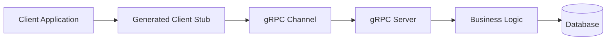

Unlike REST APIs, clients never call URLs.

Instead, they invoke methods on generated **stub objects**, which internally communicate with the server using HTTP/2 and Protocol Buffers.

---

# What is gRPC?

gRPC (Google Remote Procedure Call) is a modern high-performance RPC framework developed by Google.

Instead of exchanging JSON over HTTP like REST APIs, gRPC exchanges compact Protocol Buffer messages over HTTP/2.

A client simply calls a remote function almost as if it were a local Java method.

```text
REST

Client
   |
HTTP Request
   |
/api/stocks/AAPL
   |
Server
```

```text
gRPC

Client

blockingStub.getStock()

↓

Generated Stub

↓

HTTP/2 + Protobuf

↓

Server Method
```

The networking layer is hidden from the application developer.

---

# Why gRPC?

## REST

- Text-based (JSON)
- HTTP/1.1
- Larger payloads
- Slower serialization
- Human-readable

---

## gRPC

- Binary Protocol Buffers
- HTTP/2
- Smaller payloads
- Extremely fast serialization
- Supports streaming
- Strongly typed APIs

---

## Comparison

| Feature | REST | gRPC |
|----------|------|------|
| Data Format | JSON | Protocol Buffers |
| Protocol | HTTP/1.1 | HTTP/2 |
| Speed | Moderate | Very Fast |
| Payload Size | Large | Very Small |
| Type Safety | Weak | Strong |
| Streaming | Limited | Native |
| Contract-first Development | ❌ | ✅ |

---

# Protocol Buffers

Protocol Buffers (protobuf) are Google's language-neutral serialization format.

A `.proto` file defines:

- Messages (Data Models)
- Services
- RPC Methods

Example:

```proto
syntax = "proto3";

service StockTradingService {

    rpc GetStock(StockRequest)
        returns (StockResponse);

}

message StockRequest {
    string stock_symbol = 1;
}

message StockResponse {
    string stock_symbol = 1;
    double price = 2;
}
```

This single file becomes the source of truth for both the server and every client.

The `protoc` compiler generates native Java classes from it.

---

# Proto File Naming Conventions

Following good naming conventions makes generated Java classes much cleaner.

## Services

Use nouns describing the business domain.

```proto
service StockTradingService
```

Avoid

```proto
service StockServiceImpl
service StockAPI
service MyGrpc
```

---

## RPC Methods

Use verbs.

```proto
rpc GetStock(...)
rpc GetAllStocks(...)
rpc AddStock(...)
rpc UpdateStock(...)
rpc DeleteStock(...)
rpc SubscribeStock(...)
rpc BulkStockOrder(...)
rpc LiveTrading(...)
```

---

## Request Messages

Always end with **Request**

```proto
StockRequest
AddStockRequest
UpdateStockRequest
DeleteStockRequest
StockOrderRequest
```

---

## Response Messages

Always end with **Response**

```proto
StockResponse
StockListResponse
DeleteStockResponse
```

---

## Streaming Summary Messages

Use descriptive names.

```proto
TradeStatus
StockOrderSummary
```

Avoid generic names like

```proto
Response
Result
Data
Object
```

---

# How Java Classes are Generated

Suppose the proto file contains

```proto
service StockTradingService {

    rpc GetStock(StockRequest)
        returns (StockResponse);

}
```

The generated Java classes will look similar to:

```text
StockTradingServiceGrpc

├── StockTradingServiceImplBase
│
├── StockTradingServiceBlockingStub
│
├── StockTradingServiceStub
│
├── StockTradingServiceFutureStub
│
└── newBlockingStub()
```

Messages become ordinary Java classes.

```text
StockRequest

StockResponse

Empty

StockOrderRequest

TradeStatus

StockOrderSummary
```

---

# Generated Java Classes Explained

## 1. Message Classes

Every `message` becomes an immutable Java class.

Example

```proto
message StockRequest {

    string stock_symbol = 1;

}
```

becomes

```java
StockRequest request =
        StockRequest.newBuilder()
                .setStockSymbol("AAPL")
                .build();
```

Notice how protobuf converts

```text
stock_symbol
```

into

```java
setStockSymbol()
```

using standard Java camelCase conventions.

---

## 2. Service Base Class

Every service generates a base class for the server.

```java
StockTradingServiceGrpc
        .StockTradingServiceImplBase
```

Your server extends this class.

```java
@GrpcService
public class StockService
        extends StockTradingServiceImplBase {
}
```

You override only the methods you implement.

---

## 3. Blocking Stub

Generated for synchronous unary calls.

```java
StockTradingServiceGrpc
        .StockTradingServiceBlockingStub
```

Example

```java
StockResponse response =
        blockingStub.getStock(request);
```

The caller waits until the server responds.

---

## 4. Async Stub

Generated as

```java
StockTradingServiceGrpc
        .StockTradingServiceStub
```

This stub is required for all streaming RPCs and can also perform asynchronous unary calls.

Instead of returning values directly, it communicates through `StreamObserver`.

---

## 5. Future Stub

Generated as

```java
StockTradingServiceGrpc
        .StockTradingServiceFutureStub
```

Returns Guava `ListenableFuture` objects.

Useful when integrating with asynchronous Java code.

---

# Relationship Between Generated Classes

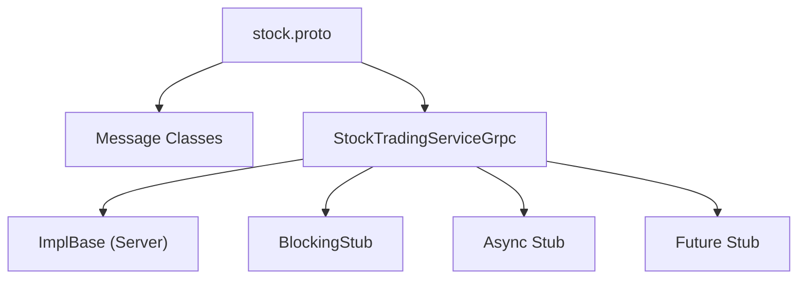

The `.proto` file is the **single source of truth**.

Every client and every server generates the exact same contract from it, ensuring type safety and eliminating API mismatches.

---

# Spring Boot gRPC Server

A gRPC server exposes remote procedures (RPC methods) that can be invoked directly by gRPC clients.

Unlike Spring MVC, there are **no HTTP endpoints** such as

```
GET /stocks
POST /stocks
```

Instead, the client invokes service methods defined inside the `.proto` file.

```
Client

↓

Generated Stub

↓

gRPC Service Method

↓

Business Logic

↓

Database
```

---

## Required Dependency

```gradle
implementation 'org.springframework.grpc:spring-grpc-spring-boot-starter'
```

---

# Creating a gRPC Service

A gRPC service is simply a Spring Bean annotated with `@GrpcService`.

```java
@GrpcService
public class StockTradingServiceImpl
        extends StockTradingServiceGrpc.StockTradingServiceImplBase {

}
```

The annotation registers the service with the embedded gRPC server.

Notice that we extend

```java
StockTradingServiceImplBase
```

This class is generated automatically from the `.proto` file.

---

# Overriding Generated Methods

Suppose the proto contains

```proto
rpc GetStock(StockRequest)
    returns (StockResponse);
```

The generated Java method becomes

```java
public void getStock(
        StockRequest request,
        StreamObserver<StockResponse> responseObserver)
```

Notice something interesting.

The proto says

```
Input

↓

StockRequest

↓

Output

↓

StockResponse
```

Yet the Java method returns

```java
void
```

instead of

```java
StockResponse
```

Why?

That is where **StreamObserver** comes in.

---

# Understanding StreamObserver

`StreamObserver` is gRPC's mechanism for sending responses back to the client.

Instead of returning values directly, the server writes values into the observer.

```java
responseObserver.onNext(response);
responseObserver.onCompleted();
```

Think of it like a delivery box.

```
Method

↓

Creates Response

↓

Places Response
inside StreamObserver

↓

gRPC sends it
to the client
```

---

## Why Doesn't the Method Return StockResponse?

Imagine gRPC had used

```java
StockResponse getStock(...)
```

This would work only for Unary RPC.

But how would Server Streaming work?

```
StockResponse

StockResponse

StockResponse

StockResponse

...
```

A method can return only one object.

Streaming requires sending many objects over time.

Instead of designing different APIs for every RPC type, gRPC uses the same abstraction everywhere:

**StreamObserver**

This single abstraction supports

- one response
- multiple responses
- asynchronous responses
- bidirectional communication

with exactly the same API.

---

# The Three Important Methods

## onNext()

Sends one message.

```java
responseObserver.onNext(response);
```

Unary

```
onNext()

↓

one response
```

Server Streaming

```
onNext()

↓

response 1

↓

response 2

↓

response 3

↓

response 4
```

---

## onCompleted()

Marks the stream as finished.

```java
responseObserver.onCompleted();
```

No more messages can be sent afterwards.

---

## onError()

Terminates the RPC with an error.

```java
responseObserver.onError(exception);
```

The client immediately receives the error.

---

# Unary RPC

Unary RPC is the simplest communication model.

One request.

One response.

```
Client

Request

↓

Server

↓

Response
```

It is the gRPC equivalent of a normal REST endpoint.

---

## Proto Definition

```proto
rpc GetStock(StockRequest)
    returns (StockResponse);
```

---

## Request Flow

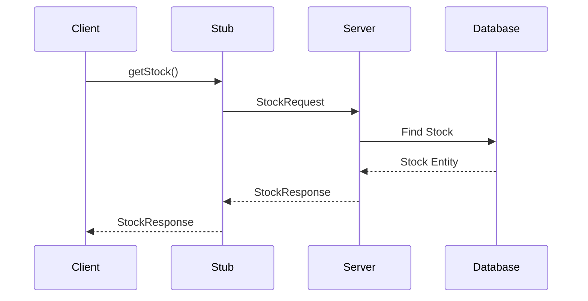

---

# Unary Service Implementation

```java
@Override
public void getStock(
        StockRequest request,
        StreamObserver<StockResponse> responseObserver) {

    String stockSymbol = request.getStockSymbol();

    Stock stock =
            stockRepository.findByStockSymbol(stockSymbol);

    StockResponse response =
            StockResponse.newBuilder()
                    .setStockSymbol(stock.getStockSymbol())
                    .setPrice(stock.getPrice())
                    .setTimestamp(stock.getLastUpdated().toString())
                    .build();

    responseObserver.onNext(response);

    responseObserver.onCompleted();
}
```

---

# Execution Flow

```
Client sends StockRequest

↓

Server receives request

↓

Business Logic

↓

Database

↓

Create StockResponse

↓

responseObserver.onNext()

↓

responseObserver.onCompleted()

↓

Client receives response
```

---

# Why Call onCompleted()?

Sending the response and ending the RPC are two different actions.

```
onNext()

↓

"I have another message."
```

```
onCompleted()

↓

"I'm done sending messages."
```

Unary RPC always sends exactly one message.

Therefore

```java
responseObserver.onNext(response);

responseObserver.onCompleted();
```

are both required.

---

# Server Configuration

Spring Boot exposes the gRPC server through configuration.

```yaml
grpc:
  server:
    port: ${SERVER_PORT}
    enable-reflection: true
```

---

## Server Port

```yaml
grpc:
  server:
    port: 9090
```

Runs the embedded gRPC server on port **9090**.

Unlike Spring MVC,

```
8080
```

is **not** used unless explicitly configured.

---

## Reflection

```yaml
enable-reflection: true
```

Reflection exposes service metadata.

This allows external tools such as

- Postman
- BloomRPC
- grpcurl
- Evans

to discover available services and RPC methods without manually importing generated Java code.

For production environments, reflection is often disabled for security reasons.

---

# Important Difference from REST

REST exposes URLs.

```
GET /stocks

POST /stocks

DELETE /stocks/1
```

gRPC exposes **methods**.

```
GetStock()

AddStock()

DeleteStock()

SubscribeStock()
```

The client never builds HTTP URLs manually.

Instead, it calls methods on generated stub objects, which internally handle:

- HTTP/2
- serialization
- network communication
- deserialization
- retries (if configured)

This makes remote procedure calls feel almost identical to ordinary Java method calls.

---

# Spring Boot gRPC Client

A gRPC client consumes remote services exposed by a gRPC server.

Unlike REST clients, it **does not make HTTP requests directly**.

Instead, it communicates using **generated stubs**.

```
Client Code

↓

Generated Stub

↓

gRPC Channel

↓

HTTP/2

↓

Server
```

The stub hides all networking details, allowing remote methods to be called as though they were local Java methods.

---

# Required Dependency

```gradle
implementation 'org.springframework.grpc:spring-grpc-client-spring-boot-starter'
```

---

# Import the Same .proto File

Both the server and client **must use the exact same `.proto` file**.

```
stock.proto

        ↓

Generate Java Classes

        ↓

Server

AND

Client
```

This ensures that both applications agree on:

- Messages
- Services
- RPC Methods
- Serialization Format

The `.proto` file acts as the **contract** between the client and the server.

---

# What are Stubs?

A **stub** is an auto-generated Java class that acts as a **proxy** for a remote gRPC service.

Instead of manually creating HTTP requests, the client simply calls methods on the stub.

```java
blockingStub.getStock(request);
```

Although this looks like an ordinary Java method call, internally the stub:

- Serializes the request into Protocol Buffers
- Opens a HTTP/2 stream
- Sends the request to the server
- Waits for the response (blocking stub)
- Deserializes the response back into Java objects

The networking layer is completely hidden from the developer.

---

# How Stubs are Generated

Given the following service:

```proto
service StockTradingService {

    rpc GetStock(StockRequest)
        returns (StockResponse);

}
```

The Protocol Buffer compiler generates:

```text
StockTradingServiceGrpc

├── StockTradingServiceBlockingStub
├── StockTradingServiceStub
├── StockTradingServiceFutureStub
├── StockTradingServiceImplBase
└── Factory Methods
```

Each stub serves a different purpose.

---

# Types of Stubs

## Blocking Stub

```java
StockTradingServiceBlockingStub
```

Characteristics

- Synchronous
- Caller waits for the response
- Best suited for Unary RPC

Example

```java
StockResponse response =
        blockingStub.getStock(request);
```

Execution

```
Request

↓

Wait...

↓

Response

↓

Continue Execution
```

---

## Async Stub

```java
StockTradingServiceStub
```

Characteristics

- Non-blocking
- Uses StreamObserver
- Required for all streaming RPCs
- Can also perform asynchronous unary calls

Execution

```
Request

↓

Continue Working

↓

Response Arrives Later

↓

onNext()
```

---

## Future Stub

```java
StockTradingServiceFutureStub
```

Returns

```java
ListenableFuture<T>
```

Useful when integrating with asynchronous Java workflows.

---

# Which Stub Should You Use?

| RPC Type | Recommended Stub |
|-----------|------------------|
| Unary | Blocking Stub |
| Unary (Async) | Async Stub |
| Server Streaming | Async Stub |
| Client Streaming | Async Stub |
| Bidirectional Streaming | Async Stub |

---

# Client Configuration

Configure the gRPC channel inside `application.yml`.

```yaml
spring:
  grpc:
    client:
      channels:
        stock-server:
          address: "localhost:9090"
          negotiation-type: PLAINTEXT
```

---

## Address

```yaml
address: "localhost:9090"
```

Specifies where the client should connect.

```
localhost

↓

Port 9090

↓

gRPC Server
```

---

## Negotiation Type

```yaml
negotiation-type: PLAINTEXT
```

Disables TLS.

Suitable for

- Local Development
- Learning
- Testing

For production, TLS should generally be enabled.

---

# Creating a Stub Bean

Unlike REST templates, gRPC clients require a stub instance.

Create it as a Spring Bean.

```java
@Configuration
public class GrpcClientConfiguration {

    @Bean
    StockTradingServiceGrpc.StockTradingServiceBlockingStub blockingStub(
            GrpcChannelFactory channels) {

        return StockTradingServiceGrpc.newBlockingStub(
                channels.createChannel("stock-server"));
    }

}
```

The `GrpcChannelFactory` creates a communication channel using the configuration defined in `application.yml`.

The generated factory method

```java
newBlockingStub(...)
```

creates a blocking stub that is connected to that channel.

---

# Injecting the Stub

Since the stub is a Spring Bean, it can be injected like any other dependency.

```java
@Service
@RequiredArgsConstructor
public class StockClientService {

    private final StockTradingServiceGrpc
            .StockTradingServiceBlockingStub blockingStub;

}
```

---

# Calling the Server

Suppose the server exposes

```proto
rpc GetAllStocks(Empty)
returns (StockListResponse);
```

The client simply invokes:

```java
public StockListResponse getAllStocks() {

    return blockingStub.getAllStocks(
            Empty.newBuilder().build());

}
```

Notice that no HTTP request is created manually.

The stub takes care of:

- Serialization
- Networking
- HTTP/2 Communication
- Response Parsing

---

# Complete Unary Client Flow

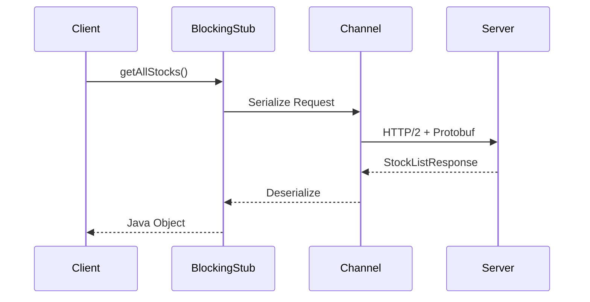

---

# Why Doesn't the Client Use HTTP Calls?

A common question is:

> "Why can't I simply use RestTemplate or WebClient?"

Because a gRPC server **does not expose REST endpoints**.

There are no URLs such as:

```
GET /stocks

POST /stocks
```

Instead, the server exposes **RPC methods**.

The only way to invoke those methods is through the generated stubs.

---

# Why Does the Client Exit Immediately?

A Spring Boot gRPC **server** starts a persistent background process.

```
Application Starts

↓

Server Starts

↓

Wait Forever

↓

Accept Client Requests
```

A standalone gRPC **client** behaves differently.

```
Application Starts

↓

Call Server

↓

Main Thread Finishes

↓

Application Exits
```

Once the main thread completes, the JVM terminates.

Therefore, streaming clients often appear to "disconnect immediately" unless something keeps the application alive.

Common approaches include:

- Waiting for user input
- Using a `CountDownLatch`
- Running inside another Spring Boot application
- Sleeping the main thread during demonstrations

---

# Common gRPC Status Codes

Unlike REST, gRPC returns **status codes**, not HTTP status codes.

Some commonly encountered ones are:

| Code | Meaning |
|------:|---------|
| `0` | OK |
| `1` | CANCELLED |
| `3` | INVALID_ARGUMENT |
| `5` | NOT_FOUND |
| `7` | PERMISSION_DENIED |
| `13` | INTERNAL |
| `14` | UNAVAILABLE |
| `16` | UNAUTHENTICATED |

For example:

```
Status Code: 14

UNAVAILABLE
```

usually indicates that:

- The server is not running
- The client is connected to the wrong port
- The gRPC channel was shut down
- A network failure occurred

This is one of the most common errors encountered during development.

---

# Server Streaming RPC

Server Streaming is an RPC pattern where:

- The client sends **one request**
- The server sends **multiple responses**
- The client keeps listening until the server closes the stream

This is useful whenever the server continuously produces data for a single client request.

Typical examples include:

- Live stock price updates
- Sensor readings
- Chat notifications
- Live sports scores
- Log streaming
- Download progress

---

# Communication Flow

```
             Request

Client -----------------------> Server

               Response 1
Client <-----------------------

               Response 2
Client <-----------------------

               Response 3
Client <-----------------------

               Response 4
Client <-----------------------

               Completed
Client <-----------------------
```

Unlike Unary RPC, the server does **not** stop after sending the first response.

---

# Proto Definition

Unary:

```proto
rpc GetStock(StockRequest)
returns (StockResponse);
```

Server Streaming:

```proto
rpc SubscribeStock(StockRequest)
returns (stream StockResponse);
```

The only difference is the keyword

```proto
stream
```

before the response type.

That single keyword tells gRPC:

> "The server may send zero, one, or many StockResponse messages."

---

# Generated Java Method

The generated server method looks like:

```java
public void subscribeStock(
        StockRequest request,
        StreamObserver<StockResponse> responseObserver)
```

Notice something interesting.

The method signature is **exactly the same** as Unary RPC.

Why?

Because `StreamObserver` can send:

- one message
- many messages

The server simply calls

```java
responseObserver.onNext(...)
```

as many times as needed.

---

# Server Implementation

Example:

```java
@Override
public void subscribeStock(
        StockRequest request,
        StreamObserver<StockResponse> responseObserver) {

    String stockSymbol = request.getStockSymbol();

    try {

        for (int i = 0; i < 10; i++) {

            StockResponse response =
                    StockResponse.newBuilder()
                            .setStockSymbol(stockSymbol)
                            .setPrice(new Random().nextDouble(200))
                            .setTimestamp(Instant.now().toString())
                            .build();

            responseObserver.onNext(response);

            TimeUnit.SECONDS.sleep(1);

        }

        responseObserver.onCompleted();

    } catch (InterruptedException e) {

        responseObserver.onError(e);

    }

}
```

---

# Execution Flow

```
Receive Request

↓

Start Loop

↓

Generate Response

↓

onNext()

↓

Generate Next Response

↓

onNext()

↓

Generate Next Response

↓

onNext()

↓

...

↓

onCompleted()
```

---

# Why Multiple onNext() Calls?

In Unary RPC:

```java
responseObserver.onNext(response);
```

is called exactly once.

```
Request

↓

Response

↓

Completed
```

In Server Streaming:

```java
responseObserver.onNext(response1);

responseObserver.onNext(response2);

responseObserver.onNext(response3);

responseObserver.onNext(response4);

...

responseObserver.onCompleted();
```

Each call immediately pushes another message to the client.

Think of it like writing multiple packets into the network stream.

---

# Sequence Diagram

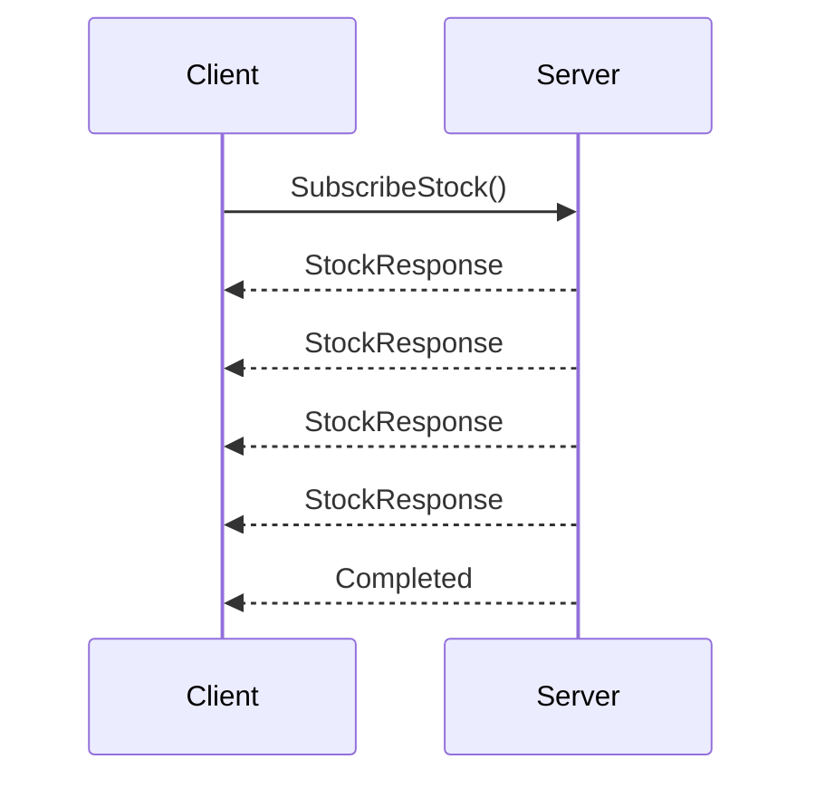

---

# Why Can't We Use BlockingStub?

Suppose the server sends

```
Price 1

Price 2

Price 3

Price 4

...
```

A Blocking Stub returns exactly **one object**.

```java
StockResponse response =
        blockingStub.getStock(...)
```

There is nowhere to store multiple incoming messages.

Instead, the client must receive responses asynchronously.

That is why Server Streaming requires the Async Stub.

---

# Async Stub

Generated class:

```java
StockTradingServiceGrpc
        .StockTradingServiceStub
```

Register it as a Spring Bean.

```java
@Bean
StockTradingServiceGrpc.StockTradingServiceStub serviceStub(
        GrpcChannelFactory channels) {

    return StockTradingServiceGrpc.newStub(
            channels.createChannel("stock-server"));

}
```

Notice we now use

```java
newStub()
```

instead of

```java
newBlockingStub()
```

---

# Client Implementation

```java
@Service
@RequiredArgsConstructor
public class StockClientService {

    private final StockTradingServiceGrpc
            .StockTradingServiceStub serviceStub;

}
```

---

# Receiving the Stream

```java
public void subscribeStock(StockRequest request) {

    serviceStub.subscribeStock(
            request,
            new StreamObserver<StockResponse>() {

                @Override
                public void onNext(StockResponse value) {

                    log.info("{}", value);

                }

                @Override
                public void onError(Throwable t) {

                    log.error(t.getMessage());

                }

                @Override
                public void onCompleted() {

                    log.info("Stream Completed");

                }

            });

}
```

Notice that the client never receives a return value.

Instead, the server "pushes" each message into

```java
onNext()
```

---

# StreamObserver Lifecycle (Client Side)

```
Server sends Response #1

↓

onNext()

↓

Server sends Response #2

↓

onNext()

↓

Server sends Response #3

↓

onNext()

↓

Server finishes

↓

onCompleted()
```

If something goes wrong,

```
Server

↓

onError()

↓

Client receives Exception
```

instead.

---

# Complete Request Flow

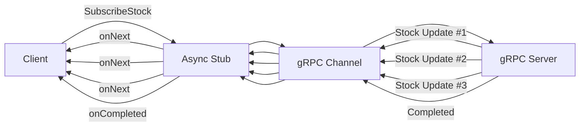

---

# Real-World Examples

Server Streaming is ideal whenever the server continuously generates data.

Examples:

- 📈 Live stock market prices
- 🌦️ Weather updates
- 📡 IoT sensor monitoring
- 🎮 Multiplayer game events
- 📺 Live sports scores
- 📜 Server log streaming
- 📊 Dashboard metrics
- 🔔 Notification systems

The client requests the stream once and then simply waits for updates, rather than repeatedly polling the server.

---

# Best Practices

- Always call `onCompleted()` after sending the final message.
- Use `onError()` to terminate the stream when failures occur.
- Avoid long-running blocking operations inside `onNext()`.
- Send updates only when necessary to reduce network traffic.
- If updates are continuous, consider implementing cancellation support so clients can unsubscribe cleanly.

---

# Common Mistakes

❌ Using a `BlockingStub` for a streaming RPC.

❌ Forgetting to call `onCompleted()`.

❌ Swallowing exceptions instead of invoking `responseObserver.onError()`.

❌ Performing heavy work inside the streaming loop without proper threading, which can delay subsequent messages.


---

# Client Streaming RPC

Client Streaming is an RPC pattern where:

- The client sends **multiple requests**
- The server receives all of them
- The server processes the complete stream
- The server sends **one final response**

Unlike Server Streaming, the direction of streaming is reversed.

Typical use cases include:

- Bulk stock orders
- Bulk user creation
- File uploads
- Batch database inserts
- Sensor data collection
- Analytics aggregation

---

# Communication Flow

```
               Request #1

Client -----------------------> Server

               Request #2

Client -----------------------> Server

               Request #3

Client -----------------------> Server

               Request #4

Client -----------------------> Server

               Completed

Client -----------------------> Server

                Summary Response

Client <----------------------- Server
```

The server does **not** immediately respond to each request.

Instead, it waits until the client finishes sending the stream.

---

# Proto Definition

```proto
rpc BulkStockOrder(stream StockOrderRequest)
returns (StockOrderSummary);
```

Notice where the keyword `stream` appears.

```
stream StockOrderRequest
```

This indicates that **the client streams requests**.

The response remains a single object.

---

# Generated Java Method

The generated server method becomes:

```java
public StreamObserver<StockOrderRequest> bulkStockOrder(
        StreamObserver<StockOrderSummary> responseObserver)
```

At first glance, this looks confusing.

The request type appears as the **return type**, while the response type appears as the **method parameter**.

Let's understand why.

---

# Why Does the Method Signature Look "Reversed"?

Unary RPC looked like this:

```java
public void getStock(
        StockRequest request,
        StreamObserver<StockResponse> responseObserver)
```

The server immediately receives one request.

No additional requests will ever arrive.

So the request can simply be passed as a method parameter.

---

Now consider Client Streaming.

The client may send

```
Order 1

↓

Order 2

↓

Order 3

↓

Order 4

↓

Order 5

↓

...
```

The server cannot receive all these requests as a single parameter because they don't exist yet—they arrive over time.

Instead, gRPC asks the server:

> "Give me an object that knows how to receive future messages."

That object is:

```java
StreamObserver<StockOrderRequest>
```

Each time the client sends another request,

gRPC invokes

```java
onNext(...)
```

on that observer.

So in streaming RPCs:

- **The method parameter (`responseObserver`) represents the outgoing stream**, because the server already knows how to send responses.
- **The method return value (`StreamObserver<Request>`) represents the incoming stream**, because gRPC needs an object that can accept requests arriving later.

You can think of it like this:

```
Unary RPC

Server already HAS the request

↓

Method Parameter


Client Streaming

Server DOESN'T have all requests yet

↓

Returns a receiver

↓

gRPC feeds incoming messages
into that receiver
```

This design allows gRPC to handle an arbitrary number of incoming messages without blocking the method call.

---

# Server Implementation

```java
@Override
public StreamObserver<StockOrderRequest> bulkStockOrder(
        StreamObserver<StockOrderSummary> responseObserver) {

    return new StreamObserver<StockOrderRequest>() {

        private int totalOrders = 0;
        private double totalAmount = 0.0;
        private int successCount = 0;

        @Override
        public void onNext(StockOrderRequest value) {

            totalOrders++;

            totalAmount += value.getPrice();

            successCount++;

        }

        @Override
        public void onError(Throwable t) {

            System.out.println(t.getMessage());

        }

        @Override
        public void onCompleted() {

            StockOrderSummary summary =
                    StockOrderSummary.newBuilder()
                            .setTotalOrders(totalOrders)
                            .setTotalAmount(totalAmount)
                            .setSuccessCount(successCount)
                            .build();

            responseObserver.onNext(summary);

            responseObserver.onCompleted();

        }

    };

}
```

---

# Execution Lifecycle

```
Method Invoked

↓

Return Request Observer

↓

Client sends Order #1

↓

onNext()

↓

Client sends Order #2

↓

onNext()

↓

Client sends Order #3

↓

onNext()

↓

Client finishes

↓

onCompleted()

↓

Build Summary

↓

Send Summary

↓

responseObserver.onNext()

↓

responseObserver.onCompleted()
```

---

# Understanding onNext()

Every client request automatically triggers

```java
onNext()
```

```
Client

↓

Order #1

↓

onNext()

↓

Order #2

↓

onNext()

↓

Order #3

↓

onNext()
```

Notice that the server method itself is **not** called repeatedly.

The method executes only once.

After returning the `StreamObserver`, gRPC repeatedly invokes its callbacks as new messages arrive.

---

# Sequence Diagram

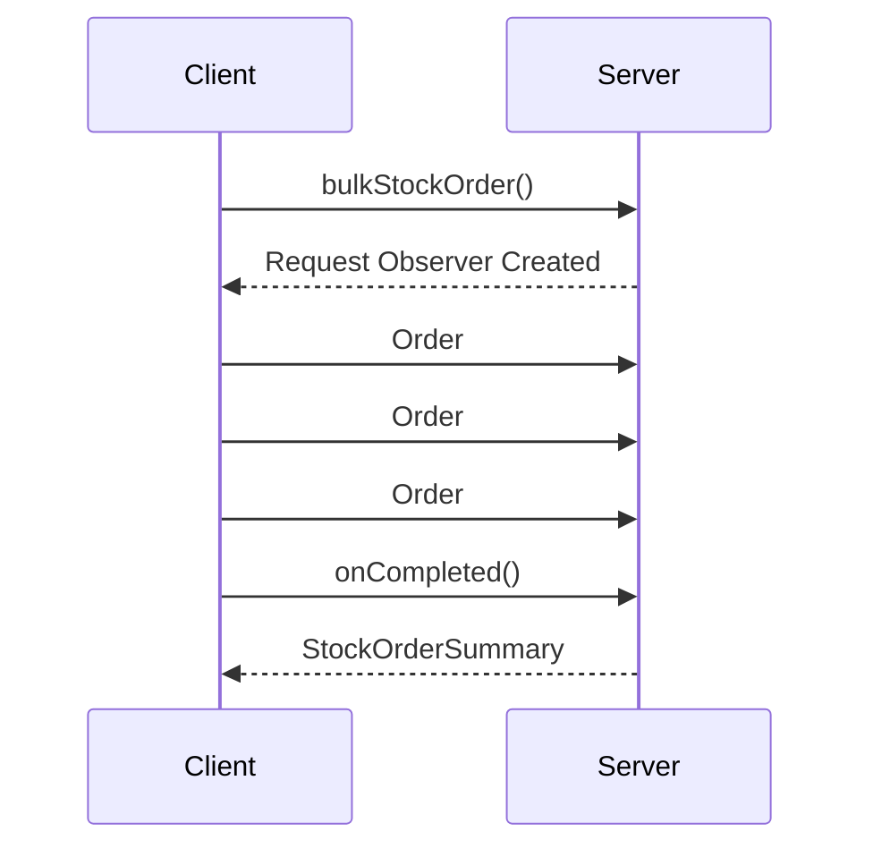

---

# Client Side

Client Streaming requires the **Async Stub**.

```java
private final StockTradingServiceGrpc
        .StockTradingServiceStub serviceStub;
```

---

# Creating the Response Observer

```java
StreamObserver<StockOrderSummary> responseObserver =
        new StreamObserver<>() {

            @Override
            public void onNext(StockOrderSummary value) {

                log.info("{}", value);

            }

            @Override
            public void onError(Throwable t) {

                log.error(t.getMessage());

            }

            @Override
            public void onCompleted() {

                log.info("Stream Completed");

            }

        };
```

This observer receives the **single summary response** from the server.

---

# Obtaining the Request Observer

```java
StreamObserver<StockOrderRequest> requestObserver =
        serviceStub.bulkStockOrder(responseObserver);
```

This object is used to send requests to the server.

Think of it as a writable stream.

---

# Sending Requests

```java
requestObserver.onNext(order1);

requestObserver.onNext(order2);

requestObserver.onNext(order3);
```

Each `onNext()` call sends another protobuf message to the server.

Unlike Unary RPC, these messages are transmitted independently without waiting for a response.

---

# Finishing the Stream

After sending every request,

the client must call

```java
requestObserver.onCompleted();
```

This tells the server:

> "I'm done sending requests. You may now process everything and reply."

Without this call, the server continues waiting for more messages and may never produce the final response.

---

# Complete Request Flow

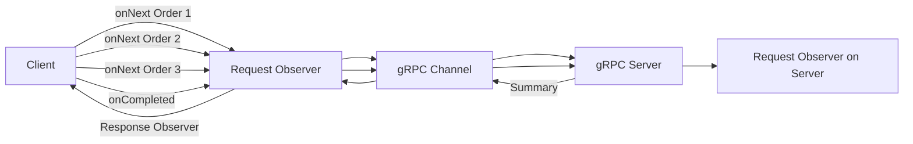

---

# Real-World Examples

Client Streaming is useful when the client naturally produces a sequence of data before expecting a result.

Examples include:

- 📈 Bulk stock order placement
- 📤 Uploading a large file in chunks
- 🧾 Batch invoice processing
- 📊 Sending analytics events
- 📍 GPS coordinate collection
- 📡 IoT telemetry uploads

Instead of making hundreds of Unary RPC calls, the client opens one stream, sends all data, and receives one aggregated response.

---

# Best Practices

- Always call `requestObserver.onCompleted()` after the last request.
- Perform validation inside `onNext()` if each message must be checked individually.
- Aggregate results efficiently to avoid excessive memory usage.
- Call `responseObserver.onError()` when the entire operation must fail.
- Keep `onNext()` lightweight if processing high-throughput streams.

---

# Common Mistakes

❌ Forgetting to call `requestObserver.onCompleted()`.

❌ Expecting a response after every `onNext()`.

❌ Returning a response before the client has finished streaming.

❌ Performing expensive blocking work inside `onNext()` for every message instead of batching when appropriate.

---

# Bidirectional Streaming RPC

Bidirectional Streaming is the most powerful communication model supported by gRPC.

Unlike the previous RPC types, **both the client and the server stream messages independently**.

This means:

- The client can continuously send requests.
- The server can continuously send responses.
- Neither side waits for the other.
- Communication happens simultaneously over a single HTTP/2 connection.

Think of it as a live conversation rather than a request-response interaction.

Typical examples include:

- 💬 Live chat applications
- 📈 Live stock trading
- 🎮 Multiplayer games
- 🎙️ Voice/video streaming
- 📡 IoT command & telemetry
- 🤖 AI assistants with streaming responses

---

# Communication Flow

```
Client                     Server

Order #1 ----------------------->

              <-------------------- Status #1

Order #2 ----------------------->

              <-------------------- Status #2

Order #3 ----------------------->

              <-------------------- Status #3

Order #4 ----------------------->

              <-------------------- Status #4

...

Completed ----------------------->

              <-------------------- Completed
```

Notice that both sides can send messages **at any time**.

Neither side has to wait.

---

# Proto Definition

```proto
rpc LiveTrading(stream StockOrderRequest)
returns (stream TradeStatus);
```

Both the request and response contain the keyword

```proto
stream
```

This tells gRPC that:

- The client sends many requests.
- The server sends many responses.

---

# Generated Java Method

```java
public StreamObserver<StockOrderRequest> liveTrading(
        StreamObserver<TradeStatus> responseObserver)
```

This looks almost identical to Client Streaming.

The difference is **how we use the response observer**.

Client Streaming:

```
Receive many requests

↓

One response
```

Bidirectional Streaming:

```
Receive request

↓

Immediately send response

↓

Receive next request

↓

Immediately send next response

↓

Repeat...
```

---

# Server Implementation

```java
@Override
public StreamObserver<StockOrderRequest> liveTrading(
        StreamObserver<TradeStatus> responseObserver) {

    return new StreamObserver<StockOrderRequest>() {

        @Override
        public void onNext(StockOrderRequest value) {

            System.out.println("Received: " + value);

            String status = "EXECUTED";
            String message = "Order placed successfully";

            if (value.getQuantity() <= 0) {

                status = "FAILED";
                message = "Invalid Quantity";

            }

            TradeStatus tradeStatus =
                    TradeStatus.newBuilder()
                            .setOrderId(value.getOrderId())
                            .setStatus(status)
                            .setMessage(message)
                            .setTimestamp(Instant.now().toString())
                            .build();

            responseObserver.onNext(tradeStatus);

        }

        @Override
        public void onError(Throwable t) {

            responseObserver.onError(t);

        }

        @Override
        public void onCompleted() {

            responseObserver.onCompleted();

        }

    };

}
```

---

# Execution Lifecycle

```
Client sends Order #1

↓

Server receives Order #1

↓

Server immediately responds

↓

Client sends Order #2

↓

Server immediately responds

↓

Client sends Order #3

↓

Server immediately responds

↓

...

↓

Client finishes

↓

Server finishes
```

Unlike Client Streaming, the server does **not** wait for the client to finish before responding.

---

# Sequence Diagram

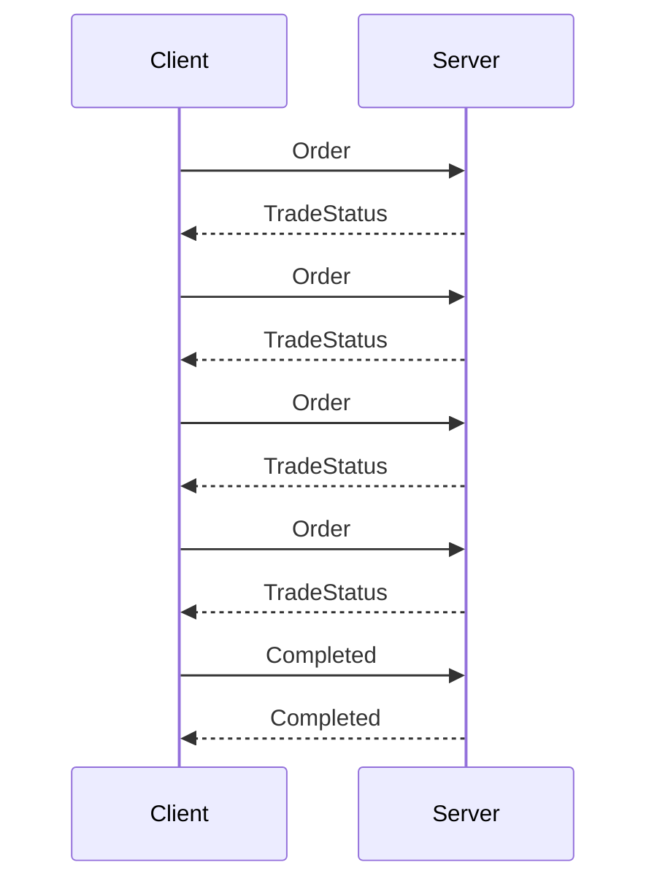

---

# Client Implementation

The client also uses the Async Stub.

```java
private final StockTradingServiceGrpc
        .StockTradingServiceStub serviceStub;
```

---

# Creating the Response Observer

```java
StreamObserver<TradeStatus> responseObserver =
        new StreamObserver<>() {

            @Override
            public void onNext(TradeStatus value) {

                System.out.println(value);

            }

            @Override
            public void onError(Throwable t) {

                System.out.println(t.getMessage());

            }

            @Override
            public void onCompleted() {

                System.out.println("Stream Completed");

            }

        };
```

This observer continuously receives updates from the server.

---

# Creating the Request Observer

```java
StreamObserver<StockOrderRequest> requestObserver =
        serviceStub.liveTrading(responseObserver);
```

The returned observer is used to continuously send orders.

---

# Sending Orders

```java
for (int i = 0; i < 10; i++) {

    StockOrderRequest request =
            StockOrderRequest.newBuilder()
                    .setOrderId("ORDER-" + i)
                    .setStockSymbol("AAPL")
                    .setQuantity(i * 10)
                    .setPrice(150 + i)
                    .setOrderType("SELL")
                    .build();

    requestObserver.onNext(request);

}
```

Each call sends another order to the server.

The server may respond immediately without waiting for the next request.

---

# Finishing the Stream

```java
requestObserver.onCompleted();
```

The server receives

```java
onCompleted()
```

and closes its own response stream.

---

# Complete Bidirectional Flow

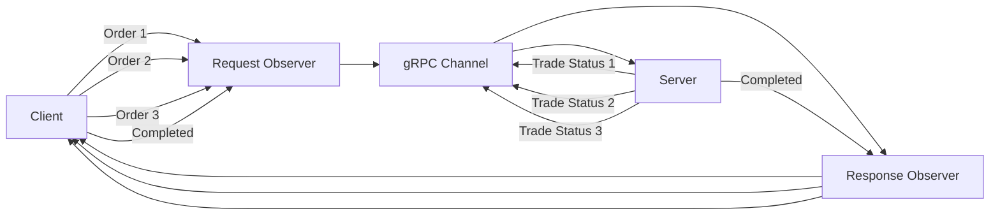

---

# Why Bidirectional Streaming?

Suppose you're building a live stock exchange.

If every order required a Unary RPC:

```
Order

↓

Wait

↓

Response

↓

Next Order

↓

Wait

↓

Response
```

there would be unnecessary latency.

Instead:

```
Order 1

↓

Order 2

↓

Order 3

↓

Order 4

↓

...

Responses arrive independently.
```

This significantly improves throughput and responsiveness.

---

# Comparing All Four RPC Types

| RPC Type | Client Sends | Server Sends | Typical Stub |
|-----------|--------------|--------------|--------------|
| Unary | One | One | Blocking / Async |
| Server Streaming | One | Many | Async |
| Client Streaming | Many | One | Async |
| Bidirectional Streaming | Many | Many | Async |

---

# Visual Comparison

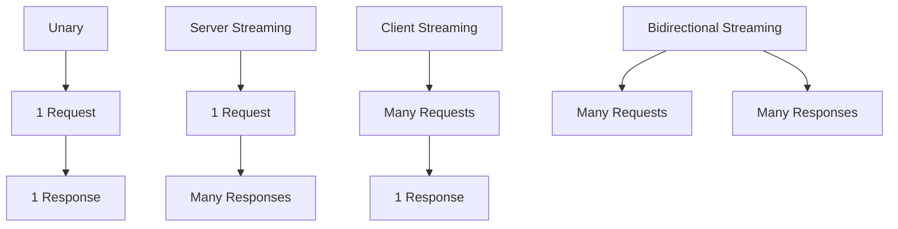

---

# Testing gRPC Services

## Postman

Postman supports:

- Unary RPC
- Server Streaming (limited support depending on version)

It displays Protocol Buffer messages as JSON for readability.

Internally, however, communication is still binary over HTTP/2.

---

## BloomRPC

BloomRPC is specifically designed for gRPC.

It allows you to:

- Import `.proto` files
- Discover services
- Invoke RPC methods
- Test Client Streaming
- Test Bidirectional Streaming

Unlike Postman, BloomRPC fully supports all four RPC patterns, making it an excellent tool for learning and debugging gRPC services.

---

# Common gRPC Status Codes

| Code | Status | Meaning |
|------:|--------|---------|
| 0 | OK | Request completed successfully |
| 1 | CANCELLED | Operation cancelled |
| 3 | INVALID_ARGUMENT | Invalid request data |
| 5 | NOT_FOUND | Resource not found |
| 7 | PERMISSION_DENIED | Access denied |
| 13 | INTERNAL | Internal server error |
| 14 | UNAVAILABLE | Server unavailable or channel closed |
| 16 | UNAUTHENTICATED | Authentication required |

For example, if you encounter:

```
UNAVAILABLE: Channel shutdownNow invoked
```

it usually indicates that:

- The server is not running.
- The client closed the channel.
- The application exited before the stream completed.
- The client is connecting to the wrong address or port.

---

# Key Takeaways

- gRPC is a high-performance RPC framework built on HTTP/2 and Protocol Buffers.
- The `.proto` file defines the contract between clients and servers.
- `protoc` generates all required Java classes, including messages and stubs.
- `StreamObserver` is the core abstraction that enables both unary and streaming communication.
- Blocking stubs are best suited for simple unary calls, while async stubs are required for streaming.
- Streaming RPCs enable efficient real-time communication with lower latency and fewer network round trips than repeatedly issuing unary requests.
- Understanding when to use each RPC type is essential for designing scalable, responsive distributed systems.